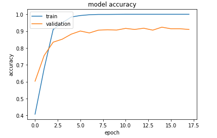
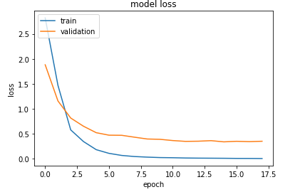
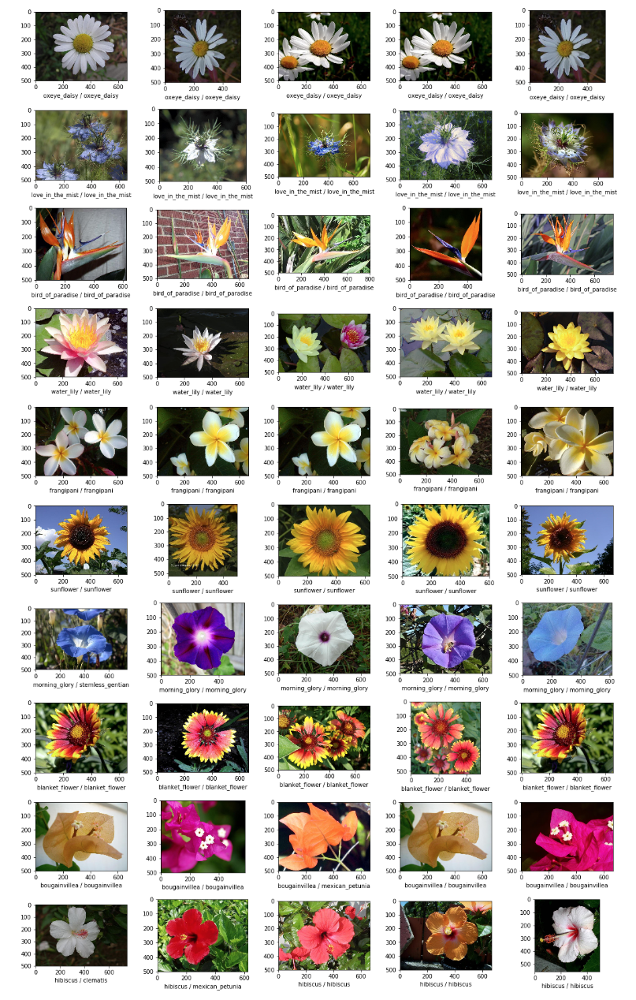

# Capstone Project - Udacity's Machine Learning Engineer Nanodegree


## Evaluation of Imagenet CNN Architectures for transfer learning classification of the Oxford102 Flower Dataset


### Hyperparameter optimization was performed for the imagenet architectures available in the Keras' applications models,  including all optimzers available in Keras


### Project Overview

Flower classification, as well as of other living-organisms, is an important task used both for scientific purposes (taxonomy in research or applied sciences, such as agronomy) and leisure. It has traditionally been cumbersome, requiring specific and specialized knowledge, as well as careful and time consuming analysis of anatomical characteristics. Not long ago this knowledge was kept in books, either to be brought to the field, of to be used in the lab, this requiring field trips to collect specimens. More recently, a much lighter version of this knowledge could be more conveniently transported to the field in a computer, or even on a smartphone. However, the process still remained the same as centuries ago, in which a person had to compare physical characteristics of the subject with the body of knowledge. This process can be greatly improved by automation, delegating the classification task to a computer.  Image classification is a common and important application of Machine Learning (ML). It is used on a wide range of applications, from individuals identification for security proposes, to identifying road signs in the live video feed of self-driving cars. This project develops a ML model to classify flowers from their images, while evaluating performance  and cost (time and money) tradeoffs. 


#### Metrics

The evaluation metric used in this project is the categorical accuracy, which reflects the mean accuracy rate across all predictions (a single prediction being the class with the highest probability out of the 102 classes).


### Methodology: Transfer learning


https://classroom.udacity.com/nanodegrees/nd013/parts/fbf77062-5703-404e-b60c-95b78b2f3f9e/modules/6df7ae49-c61c-4bb2-a23e-6527e69209ec/lessons/e12c47b6-316e-4a0b-aae5-2f2c5fcd99f5/concepts/10489223-72fa-4393-848b-f882ba3cf7f9


The Four Main Cases When Using Transfer Learning
Transfer learning involves taking a pre-trained neural network and adapting the neural network to a new, different data set.

Depending on both:

the size of the new data set, and
the similarity of the new data set to the original data set
the approach for using transfer learning will be different. There are four main cases:

new data set is small, new data is similar to original training data
new data set is small, new data is different from original training data
new data set is large, new data is similar to original training data
new data set is large, new data is different from original training data

Four Cases When Using Transfer Learning

A large data set might have one million images. A small data could have two-thousand images. The dividing line between a large data set and small data set is somewhat subjective. Overfitting is a concern when using transfer learning with a small data set.

Images of dogs and images of wolves would be considered similar; the images would share common characteristics. A data set of flower images would be different from a data set of dog images.

Each of the four transfer learning cases has its own approach. In the following sections, we will look at each case one by one.


We have a large, but different dataset. We're goint to treat it as Case 3, where the dataset is similar. Meaning,
we're going to replace the last convolutional data and initiate its weights randomly. The rest of layers will bi iniated with the network weights


## Case 4: Large Data Set, Different Data
If the new data set is large and different from the original training data:

remove the last fully connected layer and replace with a layer matching the number of classes in the new data set
retrain the network from scratch with randomly initialized weights
alternatively, you could just use the same strategy as the "large and similar" data case
Even though the data set is different from the training data, initializing the weights from the pre-trained network might make training faster. So this case is exactly the same as the case with a large, similar data set.

If using the pre-trained network as a starting point does not produce a successful model, another option is to randomly initialize the convolutional neural network weights and train the network from scratch.

##Case 3: Large Data Set, Similar Data:
If the new data set is large and similar to the original training data:

remove the last fully connected layer and replace with a layer matching the number of classes in the new data set
randomly initialize the weights in the new fully connected layer
initialize the rest of the weights using the pre-trained weights
re-train the entire neural network
Overfitting is not as much of a concern when training on a large data set; therefore, you can re-train all of the weights.

Because the original training set and the new data set share higher level features, the entire neural network is used as well.

Here is how to visualize this approach:


### Dataset: 

[Oxfoard102](http://www.robots.ox.ac.uk/~vgg/data/flowers/102/):
A Flower image dataset of 102 common flowers found in the UK


## Results:

A pdf report [pdf report](https://github.com/lfcunha/fgvcx_flower/blob/modeling_LC/report/casptone_project_v1.pdf)  can be found in the report folder. The training [Notebooks](https://github.com/lfcunha/fgvcx_flower/tree/modeling_LC/notebooks) are found the respective folder. Training was performed on AWS's P2 instances. The terraform code in the deploy folder is used to provision the infrastructure.

Briefly, comparison of all the architectures and optimizers, and hyperparameter optimization resulted in a model:
 
 - Densenet201 has highest performance
 - Mobilenet (including v2) were the fastest to train, with slightly worse accuracy (~2%) than Densenet201 (2x faster)
 - VGG, resnet, espection were slower to train (3-5x) and less accurate
 - Optimizers were less important than architecture, but CNN stands out.
 - 93% validation  accuracy
 - 79% test accuracy
 - Batch size is not too important (128 is a good choice)
 - step size to see only half the data per epoch doubles training speed while maintaining performance
 
 
 
  Validarion accuracies of several CNN architecture / optimizer combinations
  
 
 
  
 Training of a Densenet201 model with Adam optimizer
 
 
 
 
 Class prediction: 
 
 
   Labels are actual/predicted class


## Terraform deployment of training infrastruture

Use terraform to easily provision / destroy infrastructure for training. Data is persisted in a EBS volume that does not get
destroyed, and is mounted on each ec2 instance in initialization. The instance type can be configured in the variables file
or passed in the command line (see below)


- init project

```bash
terraform init # do this to install new providers
```

- list resources
```bash
terraform state list  # list resources
```

- describe a resource

```bash
terraform state show aws_instance.notebook  # describe a resource
```

- deploy
```bash
terraform plan
terraform apply
#terraform apply -var "instance_type=p2.xlarge
```

- get variable value
```bash
terraform output public_ip
```

- visualize output with graphviz online
```bash
terraform graph  
```
- Destroy infrastructure
```bash
terraform destroy

```


